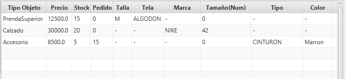
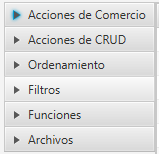
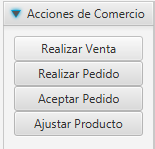
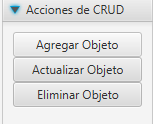
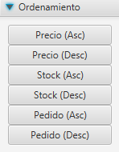
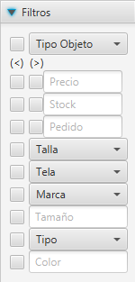
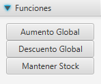
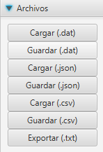
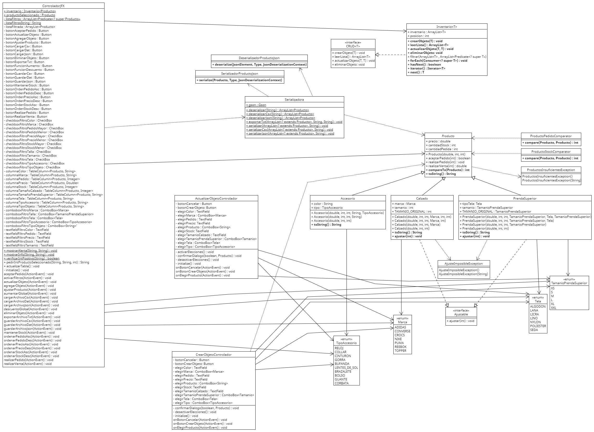

# CRUD - Productos

### Sobre Mí
Soy Alan del Canto, un estudiante en la UTN que intenta ser programador, y busco con este proyecto dar el examen final de la materia Programación II

## La Aplicación
La aplicación busca ser un sistema donde se podría manejar el stock y precio de varios productos, con funcionalidades varias, concentrados en lo que podría ser una indumentaria, y por lo tanto se pueden manejar Prendas, Calzados y Accesorios.

---

#### La vista principal

La vista principal es donde se encuentran la lista de productos y todos sus detalles, sin un límite de productos asignado.
Siempre representa a la lista ya filtrada por los filtros seleccionados

---

#### Acciones

Aquí se encuentran todas las acciones con las que interactuar con los productos en el inventario, categorizados por su funcionamiento general.

---

##### Acciones de Comercio

Son Acciones que se tomarían normalmente en un comercio.

- Realizar Venta: Pide la cantidad de productos vendidos, y si es posible, te dice el valor total de la compra y te resta los productos vendidos del sistema.
- Realizar Pedido: Pide la cantidad de productos a pedir, y los suma a la cantidad de productos pedidos, a ser aceptados cuando se reciban los productos.
- Aceptar Pedido: Pide la cantidad de productos que se recibieron en un pedido, y los suma al stock. Si se da un número muy alto, se asume que se aceptaron todos los productos pedidos anteriormente.
- Ajustar Producto: Una función especial de las Prendas y Calzados, donde se ajusta mediante métodos físicos a los elementos y se les actualiza su valor de tamaño, tiene un límite de 1 de diferencia del tamaño original en Prendas y 2 en Calzados.

---

##### Acciones de CRUD

Son Acciones para manipular a los productos.

- Agregar Objeto: Pide los detalles del producto y lo añade al inventario.
- Actualizar Objeto: Permite cambiar las características de un objeto, por si fueron introducidas mal u otras razones.
- Eliminar Objeto: Permite eliminar la entrada de un producto.

---

##### Acciones de Ordenamiento

Son Acciones para ordenar la lista de productos.

- Precio: Ordena a los productos por precio de manera Ascendiente y Descendiente, respectivamente.
- Stock: Ordena a los productos por cantidad de productos en stock de manera Ascendiente y Descendiente, respectivamente.
- Pedido: Ordena a los productos por cantidad de productos pedidos de manera Ascendiente y Descendiente, respectivamente.

---

##### Acciones de Filtrado

Son Acciones para filtrar a la lista de productos.

Cuando hay un valor válido y su respectiva casilla está activa, se puede considerar a ese filtro como activo.
Todos los filtros se aplican a la vez, y un producto tiene que cumplir todas las condiciones.
Los filtros de Precio, Stock y Pedido, tienen dos casillas, una para valor menor a (<) y valor mayor a (>).

---

##### Acciones de Funcion

Son Acciones para ejecutar ciertas funciones especiales.

- Aumento / Descuento Global: Piden un porcentaje por el que deberían aumentarse o descontarse todos los productos de la lista.
- Mantener Stock: Pide un número de productos que mantener por cada entrada, si no hay suficientes en stock, y los que están en camino no llegan a completar el número pedido, pide la cantidad necesaria para llegar a ese número.

---

##### Acciones de Archivos

Son Acciones para guardar y cargar listas de productos en archivos de diferentes formatos.

- Guardar Archivos: Guarda la lista general (Sin filtrar) en un archivo del formato seleccionado
- Cargar Archivos: Reemplaza la lista general actual por la guardada en el archivo del formato seleccionado.
- Exportar a TXT: Exporta la lista con los filtros actuales en un archivo de texto detallando todas las características de los productos que cumplan los filtros, como también los filtros utilizados en la lista.

### Diagrama UML

Diagrama de las clases del proyecto

#### Archivos de prueba
Archivos de prueba con listas de ejemplo, y los efectos de las funciones y la exportación con variados filtros

- [Lista Base (.dat)](archivos/Lista%20Base.dat)
- [Lista Base (.csv)](archivos/Lista%20Base.csv)
- [Lista Base (.json)](archivos/Lista%20Base.json)
- [Lista Aumentada 25% (.dat)](archivos/Lista%20Aumentada%2025%.dat)
- [Lista Aumentada 25% (.csv)](archivos/Lista%20Aumentada%2025%.csv)
- [Lista Aumentada 25% (.json)](archivos/Lista%20Aumentada%2025%.json)
- [Lista Descontada 15% (.dat)](archivos/Lista%20Descontada%2015%.dat)
- [Lista Descontada 15% (.csv)](archivos/Lista%20Descontada%2015%.csv)
- [Lista Descontada 15% (.json)](archivos/Lista%20Descontada%2015%.json)
- [Lista Stock Mantenido en 25(.dat)](archivos/Lista%20Stock%2025.dat)
- [Lista Stock Mantenido en 25(.csv)](archivos/Lista%20Stock%2025.csv)
- [Lista Stock Mantenido en 25(.json)](archivos/Lista%20Stock%2025.json)
- [Lista Filtrada 1](archivos/Lista%20Filtrada%201.txt)
- [Lista Filtrada 2](archivos/Lista%20Filtrada%202.txt)
- [Lista Filtrada 3](archivos/Lista%20Filtrada%203.txt)
